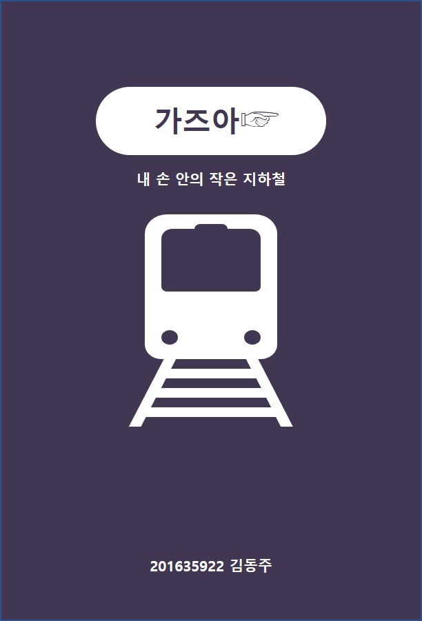

# AndroidProjects_realtimeSubway

  
모바일프로그래밍 수업 기말고사 프로젝트입니다. 

자주 이용하는 역을 등록하여 역에 대한 실시간 도착 정보와 시간	표, 근처 버스 정류장, 출구 정보 등을 빠르게 이용할 수 있는 어플리케이션

## 활용 기술
- Kotlin
- MVVM 패턴
- Room Database

## 기능

프로젝트 제안서 및 발표 문서 링크 
[https://github.com/DongJooKim1541/AndroidProjects_realtimeSubway/commit/a00efdf001af478531174589b2bf338afc01259e]
