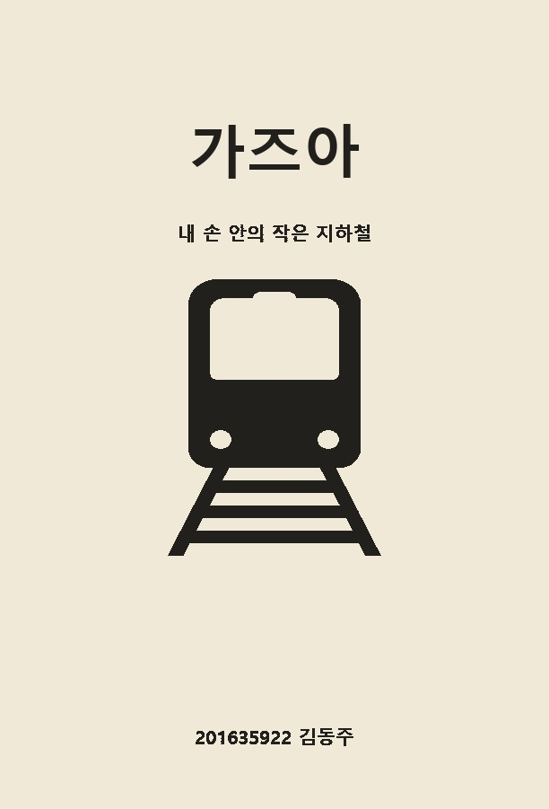

# 실시간 지하철 도착 정보 앱



자주 이용하는 지하철역을 저장해 두고 도착 시간표, 첫차/막차, 주변 버스 정류장과 출구 정보를 빠르게 확인하는 Android 앱입니다.

- **과목**: 모바일 프로그래밍 (2021)
- **언어**: Kotlin
- **데이터**: [서울 열린데이터광장](https://data.seoul.go.kr) — 아래 세 API
- **지원 범위**: 수도권 전철 799개 역을 노선도에 표시, **시간표 조회는 1~9호선**

| API | 쓰는 곳 |
|-----|---------|
| [`SearchSTNTimeTableByIDService`](https://data.seoul.go.kr/dataList/OA-101/A/1/datasetView.do) | 역코드별 시간표 조회 (조회의 본체) |
| `SearchSTNBySubwayLineInfo` | 노선·역코드·역명·역번호 목록 |
| `subwayStationMaster` | 역별 위경도 (노선도 좌표) |

뒤의 두 API 응답은 [`StationCatalog.kt`](app/src/main/java/com/example/gc_last/model/StationCatalog.kt)에
정적 표로 담아 두었습니다(2026-08-22 기준). 노선도를 그릴 때마다 조회하지 않습니다.

> **시간표는 1~9호선만 나옵니다.** 나머지 노선(수인분당·경의중앙·공항철도·신분당·인천1·2호선,
> GTX-A 등)은 시간표 API가 `INFO-200`(데이터 없음)을 돌려줍니다. 전 노선을 표본 조회해
> 확인했습니다. 노선도에는 흐리게 그리고, 고르면 조회하지 않고 안내만 합니다.

## 기능

| 기능 | 설명 |
|------|------|
| 노선도 | 첫 화면에 수도권 전철 노선도. 역을 눌러 고릅니다. 두 손가락 또는 `+`/`−` 버튼으로 확대, 끌어서 이동 |
| 역 검색 | 노선도에서 역을 고르고, 요일(평일/토요일/일요일)·방향(상행/하행)은 화면 아래 라디오 버튼으로 |
| 도착 정보 | 다가오는 열차 2편과 남은 시간. **1초마다 줄어듭니다**. 열차가 지나가면 다음 열차로 넘어갑니다 |
| 노선색 | 결과·역 정보·시간표 화면과 저장 목록 배지를 해당 노선색으로 표시 |
| 탭 | 맨 위에서 **노선도 / 저장된 역**을 전환. 저장 목록이 노선도를 가리지 않습니다 |
| 저장 | 조회 조건과 결과를 로컬 DB에 저장, 목록에서 다시 열람 |
| 시간표 | 저장한 역의 전체 / 첫차 / 곧 도착 / 막차 시간표 전환 |
| 주변 정보 | 네이버 지도로 역 주변 버스 노선·출구 정보 연결 |

## 기술 스택

| 영역 | 사용 기술 |
|------|-----------|
| 언어 | Kotlin 1.7.20 |
| 아키텍처 | MVVM (ViewModel + LiveData) |
| 비동기 | Kotlin Coroutines (`viewModelScope`, `Dispatchers.IO`) |
| 로컬 DB | Room 2.5.2 (suspend DAO) |
| 목록 | RecyclerView + Paging 2 |
| 화면 전환 | Navigation Component 2.2.2 |
| 네트워크 | OkHttp `HttpUrl` + `DocumentBuilderFactory` XML 파싱 |
| 빌드 | AGP 7.4.2 / Gradle 7.6.4 / compileSdk 33 |

## 구조

```
app/src/main/java/com/example/gc_last/
├── data/        SubwayRepository — API 조회 및 XML 파싱 단일 진입점
├── database/    DatabaseModule — Room 데이터베이스
├── model/       FreshData, SaveItem, FreshDao, Subways, DayOfWeek
├── network/     SubwayApi — 서울 열린데이터광장 URL 생성
├── ui/          FreshAdapter, FreshPagedAdapter — 공용 목록 어댑터
├── util/        TimeRemaining(남은 시간 계산), NavKeys(화면 간 Bundle 키)
├── main/        MainActivity, SplashFragment
├── search/      SearchFragment/ViewModel/Adapter — 검색 및 저장 목록
├── result/      ResultFragment/ViewModel — 검색 결과
└── local/       SaveFragment/ViewModel, SavedTimeTable* — 저장된 역 상세·시간표
```

데이터 흐름은 `Fragment → ViewModel → SubwayRepository → (Seoul OpenAPI | Room)` 한 방향입니다.
네트워크 조회와 XML 파싱은 `SubwayRepository`에만 존재하고, ViewModel은 결과를 어떤 기준으로
추릴지(전체 / 첫차 / 막차 / 다가오는 N편)만 결정합니다.

## 빌드

### 요구사항

- JDK 17
- Android SDK Platform 33, Build-Tools 33.0.2
- Android Studio (선택) 또는 Gradle wrapper

### API 키 설정 (필수)

인증키는 저장소에 포함하지 않습니다. [서울 열린데이터광장](https://data.seoul.go.kr/together/mypage/actKey.do)에서
키를 발급받아 `local.properties`에 넣으세요.

```properties
SEOUL_OPENAPI_KEY=발급받은_키
```

`SEOUL_OPENAPI_KEY` 환경변수로도 읽습니다. 키가 없으면 빌드는 되지만 조회할 때
"인증키가 유효하지 않습니다 (INFO-100)"가 화면에 표시됩니다.

> **주의: 이 방식은 키를 저장소에서만 빼냅니다.** `local.properties`는 `.gitignore`에
> 있어 git에 올라가지 않지만, 빌드하면 키가 `BuildConfig`에 문자열로 들어가 **APK 안에
> 남습니다**(`classes*.dex`에서 확인 가능). 그러므로 APK를 그대로 배포하거나 공유하면
> 키가 노출됩니다. 공개 배포가 필요하면 서버를 앞에 두고 키를 서버에만 두어야 합니다.

### 실행

```bash
git clone https://github.com/DongJooKim1541/AndroidProjects_realtimeSubway.git
cd AndroidProjects_realtimeSubway
./gradlew assembleDebug
```

산출물: `app/build/outputs/apk/debug/app-debug.apk`

`local.properties`에 SDK 경로도 필요합니다(Android Studio가 자동 생성).

```properties
sdk.dir=C:/Users/<사용자>/AppData/Local/Android/Sdk
```

> 프로젝트 경로에 한글이 포함된 환경을 지원하기 위해 `gradle.properties`에
> `android.overridePathCheck=true`를 설정해 두었습니다.

## 노선도에 대해

노선도는 **역의 실제 위경도**를 찍어 그립니다(`subwayStationMaster`). 그래서 2호선이
실제처럼 순환선 모양이 되고, 노선이 교차하는 위치도 실제와 같습니다.

[서울교통공사가 배포하는 공식 노선도](https://www.seoulmetro.co.kr)와는 모양이 다릅니다.
공식 노선도는 선을 직선과 45도로 정리해 사람이 배치한 도안이고, 그 좌표는 공개 API로
제공되지 않습니다. 그래서 재현하지 않고 실제 좌표를 씁니다.

- **환승역**: 같은 이름의 역이 여러 노선에 있으면 환승역으로 보고 흰 원으로 표시합니다.
  응답에 환승 정보 항목이 따로 없어 역명으로 판단합니다(120곳). 이름은 같지만 실제로는
  환승이 안 되는 역도 있습니다.
- **역 이름**: 확대해야 나옵니다. 도심은 역이 촘촘해 전부 쓰면 글자가 겹칩니다.
  이미 글자가 놓인 자리와 겹치는 이름은 건너뜁니다.
- **좌표가 없는 역**: 799개 중 31개는 좌표가 없어 점을 찍지 않습니다(1~9호선은 2개).
- **확대 범위**: 처음 보이는 상태(시청 중심)에서 약 11배까지 확대됩니다. 도심은 역 간격이
  200m 도 안 되는 곳이 있어 깊게 확대할 수 있어야 원하는 역을 짚을 수 있습니다.

## 문서

- [설계 문서 (SDD)](docs/SDD.md) — 아키텍처, 데이터 모델, 화면 흐름
- [테스트 케이스 (TC)](docs/TC.md) — 수동 검증 시나리오

## 라이선스

[LICENSE](LICENSE) 참고.
