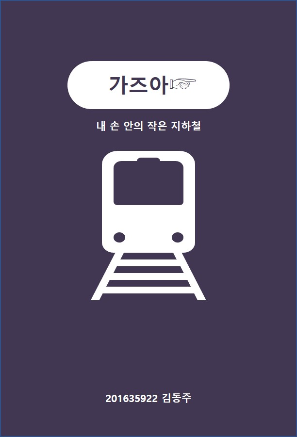

# 실시간 지하철 도착 정보 앱



자주 이용하는 역을 등록하여 역에 대한 실시간 도착 정보, 시간표, 근처 버스 정류장, 출구 정보 등을 빠르게 이용할 수 있는 모바일 애플리케이션입니다.

## 📋 프로젝트 정보

- **과목**: 모바일 프로그래밍 수업 기말고사
- **년도**: 2021학년도
- **주요 기술**: Kotlin, MVVM 패턴, Room Database

## 🛠 기술 스택

| 기술 | 용도 |
|------|------|
| **Kotlin** | 프로그래밍 언어 |
| **MVVM** | 아키텍처 패턴 |
| **Room** | 로컬 데이터베이스 |
| **Retrofit** | HTTP 클라이언트 |
| **Navigation** | Fragment 네비게이션 |
| **LiveData** | 데이터 바인딩 |

## 📱 주요 기능

1. **실시간 도착 정보**: 선택한 역의 실시간 열차 도착 예정 정보
2. **역별 시간표**: 저장된 역의 요일별 시간표 조회
3. **즐겨찾기**: 자주 이용하는 역 저장 및 관리
4. **빠른 검색**: 지하철 역명으로 빠른 검색

## 📚 문서

- [SDD (설계 문서)](docs/SDD.md)
- [테스트 케이스](docs/TC.md)
- [프로젝트 보고서](docs/project_report.md)

## 📦 설치 및 실행

### 요구사항
- Android Studio 4.0+
- Android SDK 29+
- Kotlin 1.4+

### 빌드 및 실행
```bash
# 프로젝트 클론
git clone https://github.com/DongJooKim1541/AndroidProjects_realtimeSubway.git

# Android Studio에서 열기
android studio ./AndroidProjects_realtimeSubway

# 앱 빌드 및 실행
./gradlew assembleDebug
```
